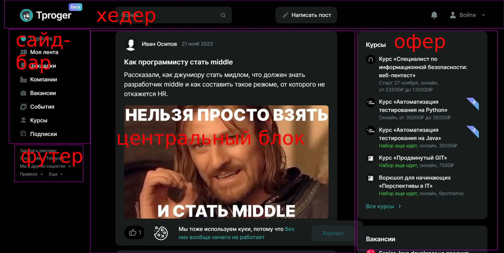

# Домашнее задание
## Условие задачи

#### **Задача:** на основе сайта любого сайта:
- Определите, на каком протоколе работает сайт.
- Проанализируйте структуру страницы сайта.
- Внесите не менее 10 изменений на страницу с помощью инструмента разработчика и представьте скриншоты было/стало.
- Создайте прототип низкой детализации (дополнительное задание, если на семинаре дошли до задания №8).

## Решение 

- Сайт работает на ***HTTPS***
- 

#### Изменения 
##### Было

- 

##### Стало

- 

##### Прототип низкой детализации

- 

